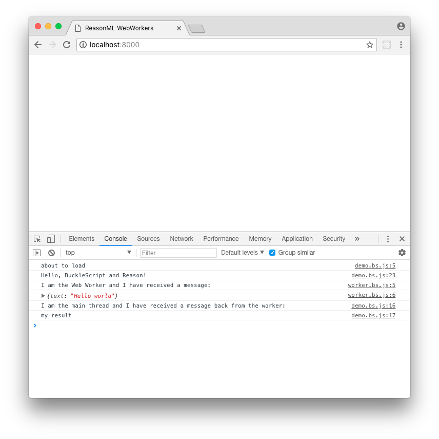

# About

This is a trivial repo demonstrating the `hello world` of webworkers.

It was only created whilst I [struggled through](https://github.com/davidgomes/bs-webworkers/issues/2) the [instructions](https://github.com/davidgomes/bs-webworkers).

Instructions:

* `npm install`
* `npm run start`
* run `python -m SimpleHTTPServer 8000` in the `src`
* open up the console in your browser
* visit `http://localhost:8000` in that browser
* check out the awesome logging in your console

NOTE: if you get a syntax error then open up `worker.bs.js` and remove the empty `export {}`.

